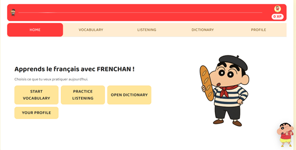
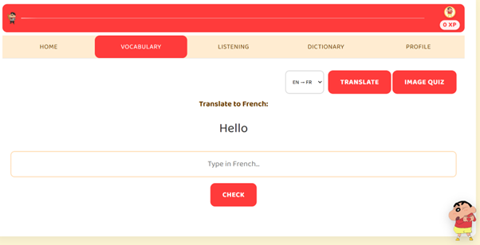
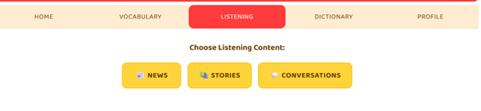
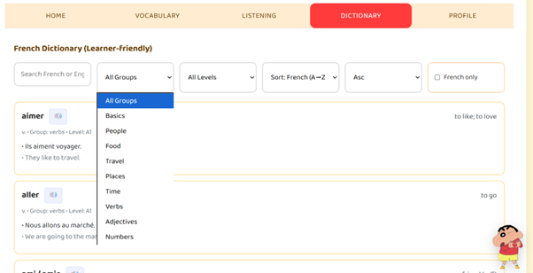
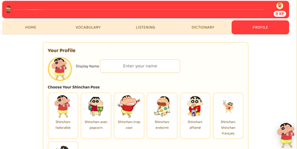

# FRENCHAN

A French learning web app with vocabulary, image quiz, and listening practice. Now structured as a modern front-end (Vite) with a Firebase Cloud Functions backend.



## Scripts

- `npm run dev` — start Vite dev server
- `npm run build` — build for production
- `npm run preview` — preview the production build locally
- `npm run lint` — run ESLint
- `npm run format` — run Prettier

## Structure

- `index.html` — app entry
- `src/main.js` — Vite entry; loads legacy `app.js` after DOM ready
- `app.js`, `styles.css` — main UI logic and styles
- `assets/` — images and icons (logo, avatars)
- `functions/` — Firebase Cloud Functions (Express API)
## Frontend






## Backend

Cloud Functions exposes `POST /saveQuizResult` via exported function `api`. Payload:
```json
{
  "userId": "<uid>",
  "quizType": "image|translate|listening",
  "itemId": 123,
  "correct": true,
  "points": 10,
  "timestamp": 1690000000000
}
```
Returns `{ ok: true }` on success. Includes simple per-IP rate limiting.

## Firebase

- Client SDK loaded via CDN in `index.html` and config in `firebase-config.js`.
- Firestore is used to persist user state and quiz results.
- To deploy functions: initialize Firebase in this project (`firebase init functions`) and deploy `functions/`.

## Notes

- Migration to modules is incremental: `src/main.js` imports `../app.js`. You can progressively split `app.js` into modules under `src/` and update imports.
- Assets currently referenced from `assets/`. Optionally move them into `public/` and update paths.
